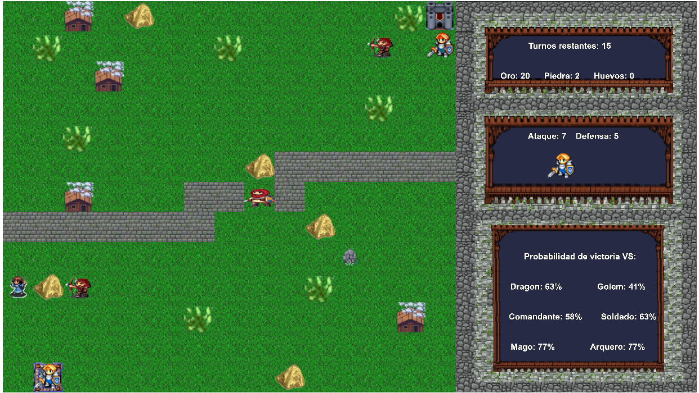

# Eig Of Empaiers

## Equipo de desarrollo

- Werba, Ramiro
- Fernandez, Agustin
- Piñero, Martin
- Santamaria, Leandro

## Capturas

## Reglas de Juego / Instrucciones

### Sobre el juego

Eig Of Empaiers es un juego de estrategia por turnos, donde debes ir recolectando recursos para spawnear tus tropas y combatir a las tropas enemigas, con el objetivo final de conquistar su castillo. 

El objetivo principal del juego es superar los 3 niveles. Cada nivel tiene una cantidad de turnos/movimientos limites. A medida que avanzas de nivel, la dificultad del mismo aumenta, donde te vas a encontrar con mayores cantidades de tropas enemigas y posiblemente algunas tropas que no habias visto en el nivel anterior. Para superar cada nivel debes derrotar a todas las tropas enemigas y tomar su castillo, pero ¡ojo!, no te quedes sin turnos o sin recursos ni tropas porque perderas.

### Detalles a tener en cuenta

- Recursos:
    - Oro: En cada nivel te vas a encontrar con pepitas de oro sueltas por el mapa. Estas te van a servir para poder spawnear tropas, la cual cada una tiene un valor detallado a continuación. Para recolectarlo debes posicionarte encima de el.
    - Piedra: En cada nivel te vas a encontrar con piedras sueltas por el mapa (en menor medida que el oro). Estas te van a servir para poder spawnear el tipo de tropa "Golem", el cual ademas de oro precisa de piedra para poder ser spawneado. Para recolectarlo debes posicionarte encima de el.
    - Huevo: En algunos niveles te vas a encontrar con el recurso mas "importante", el huevo. Este te va a permitir poder spawnear el tipo de tropa "Dragon" que es de las mas fuertes del juego, el cual ademas tambien precisa oro para poder ser spawneado. Para recolectarlo debes posicionarte encima de el.
¡Atencion! En caso de haber una o varias tropas enemigas alrededor del huevo, debes derrotarlas para poder recolectar cualquiera de los recursos.

- Tropas:
    - Tipos y requirimientos para spawn:
        - Comandante: 20 de Oro.
        - Soldado: 15 de Oro.
        - Mago: 11 de Oro.
        - Arquero: 11 de Oro.
        - Golem: 35 de oro y 3 piedras.
        - Dragon: 35 de oro y 1 huevo.

- Turnos:
    Por cada turno, se permite mover a una sola tropa y atacar una sola vez. Durante el turno, podes usar cualquier tropa aliada que tenga enemigos cerca para atacar, no es necesario atacar con la que moviste.

- Cabezal: 
    Dentro del juego existe un cabezal, que es el que controla practicamente todo movimiento y accionar de las tropas.

- Batallas:
    Las batallas se producen por azar y probabilidades. Se basa en las estadisticas de la tropa aliada, que es la atacante, y la tropa enemiga, que es la que defensora. Las probabilidades de batallar contra cualquier tropa aparecen detalladas en el juego al seleccionar una tropa aliada. 
    ¡Importante! Al atacar con un arquero, el cual es la unica tropa que tiene rango 1 y rango 2 de ataque, si batalla contra un enemigo que esta a rango 2 (a distancia) tendra un pequeño plus de probabilidad de ganar la batalla.

### Controles para jugar:

- Para Spawn:
    - Num1: Spawnea Comandante.
    - Num2: Spawnea Soldado.
    - Num3: Spawnea Arquero.
    - Num4: Spawnea Mago.
    - Num5: Spawnea Golem.
    - Num6: Spawnea Dragon.

- Cabezal:
    - Up Arrow: Mueve el cabezal hacia arriba.
    - Right Arrow: Mueve el cabezal hacia la derecha.
    - Down Arrow: Mueve el cabezal hacia abajo.
    - Left Arrow: Mueve el cabezal hacia la izquierda.
    - A: Realiza la acción correspondiente al modo actual del cabezal.
    - S: Cancela la acción del cabezal.
    - T: Pone en modo batalla al cabezal.
    - R: Termina el turno actual.

### Instrucciones:

- Sobre el cabezal:
    El cabezal tiene 4 modos. El modo inicial es el estado "Normal". Al posicionarse con el cabezal sobre una tropa aliada, al presionar la A hará que el cabezal pase al modo "Seleccion". Al estar en modo Seleccion, la tropa aliada quedara seleccionada, debiendo llevar el cabezal a la posición donde queremos mover esa tropa, debiendo apretar la letra A nuevamente para poder mover la tropa a esa posición. El cabezal automaticamente pasara a modo "Batalla", al estar en este modo al presionar la A sobre una tropa aliada cualquiera, la seleccionara para batallar. Al seleccionar una tropa aliada para batallar, el cabezal pasa al ultimo modo, el modo "Ataque", donde debemos posicionar el cabezal sobre un enemigo cercano a la tropa aliada que seleccionamos anteriormente y presionar la A para que se produzca la batalla.
    En caso de no poder "batallar" por no tener enemigos cercanos a ninguna tropa aliada y ya haber movido, presionar R para terminar el turno actual.
    Cualquier accion del cabezal puede ser cancelada presionando la tecla S.

## Otros

- Programación con Objetos I - Universidad Nacional de Quilmes
- Wollok 0.2.7
- Una vez terminado, no tenemos problemas en que el repositorio sea público.
